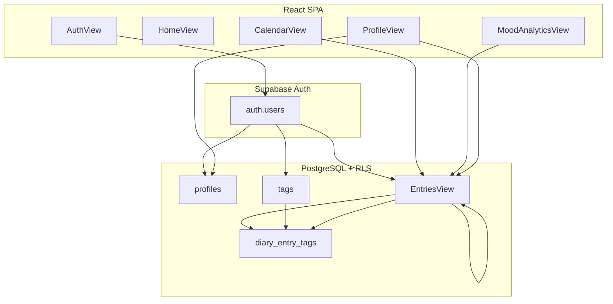

# My Dearest Diary

Aplicación web de diario personal con estética pastel. Permite escribir entradas privadas, registrar emociones (moods), organizar con etiquetas, explorar un calendario emocional, ver analíticas y exportar el diario en Markdown o PDF.

**Producción:** [https://mydearestdiary.vercel.app](https://mydearestdiary.vercel.app)

## Tecnologías

| Capa | Stack |
|------|--------|
| Frontend | React 18, Vite 6, TypeScript, Tailwind CSS 4 |
| Gráficas | Recharts |
| Backend | Supabase (Auth + PostgreSQL) |
| Deploy | Vercel |

## Características

### Autenticación

- Registro con email y contraseña
- Inicio de sesión
- Cierre de sesión
- Perfil en `public.profiles` creado automáticamente al registrarse (trigger SQL)

### Diario

- Crear, editar y eliminar entradas
- Fecha editable por entrada (`entry_date`)
- Selección de mood (emoji + etiqueta legible)
- Vista de detalle «Leer completo»
- Estadísticas en inicio (última entrada, total, racha, mood frecuente)

### Etiquetas

- Crear etiquetas personalizadas
- Reutilizar etiquetas existentes (nombre único por usuario, sin distinguir mayúsculas)
- Asociar varias etiquetas por entrada
- Chips visuales en listado y detalle

### Búsqueda

- Campo de búsqueda en la vista Entradas (filtro en memoria)
- Buscar por contenido del texto
- Buscar por mood (emoji o `mood_label`)
- Buscar por fecha (formateada o `yyyy-MM-dd`)
- Buscar por nombres de etiquetas

### Calendario

- Vista mensual con mood por día
- Si hay varias entradas el mismo día, se muestra el mood de la más reciente
- Navegación entre meses
- Resumen de moods del mes (Mood Tracker)

### Mood Analytics

- Total de entradas y mood más frecuente
- Distribución porcentual por mood
- Gráfica de dona (Recharts)
- Gráfica de barras
- Detalle por mood con barras de progreso

### Exportación

- **Markdown** (`.md`) — descarga directa desde Perfil
- **PDF** — vista imprimible del navegador («Guardar como PDF»)

### Perfil

- Nombre para mostrar y avatar (emoji)
- Estadísticas del diario (entradas, racha, mood frecuente, hora favorita de escritura)
- Exportación del diario completo

## Arquitectura

La app es una SPA sin React Router. La navegación entre vistas se controla con `useState` en `App.tsx`. Sin sesión activa solo se muestra `AuthView`; con sesión, `Navigation` + vistas protegidas.



Flujo de datos resumido:

```
Supabase Auth
    ↓
profiles (perfil del usuario)
    ↓
diary_entries (entradas del diario)
    ↓
tags + diary_entry_tags (etiquetas y relación N:M)
    ↓
Vistas: Home · Entradas · Calendario · Moods · Perfil
```

## Base de datos

Migraciones en `supabase/migrations/`:

| Tabla | Descripción |
|-------|-------------|
| `profiles` | Extensión del usuario: `display_name`, `avatar_emoji`, fechas. PK = `auth.users.id`. |
| `diary_entries` | Entradas del diario: `mood`, `mood_label`, `content`, `entry_date`, `user_id`. |
| `tags` | Etiquetas por usuario: `name`, `color` opcional. Único `(user_id, lower(trim(name)))`. |
| `diary_entry_tags` | Tabla puente entrada ↔ etiqueta (PK compuesta `entry_id`, `tag_id`). |

Todas las tablas usan **Row Level Security (RLS)**: cada usuario solo accede a sus propios datos.

## Instalación local

### Requisitos

- Node.js 18+
- Cuenta en [Supabase](https://supabase.com)

### Pasos

```bash
git clone https://github.com/abalamjimenezcbtis214/MiDiario.git
cd midiario
npm install
cp .env.example .env.local
```

Rellena `.env.local` (ver abajo) y ejecuta:

```bash
npm run dev
```

Abre la URL de Vite (por defecto `http://localhost:5173`).

### Build

```bash
npm run build
```

Genera la carpeta `dist/` para producción.

## Variables de entorno

| Variable | Descripción |
|----------|-------------|
| `VITE_SUPABASE_URL` | URL del proyecto Supabase (Settings → API) |
| `VITE_SUPABASE_ANON_KEY` | Clave **anon / public** (nunca `service_role` en el frontend) |

Ejemplo `.env.local`:

```env
VITE_SUPABASE_URL=https://tu-proyecto.supabase.co
VITE_SUPABASE_ANON_KEY=tu_clave_anon_publica
```

> Copia desde `.env.example`. El archivo `.env.local` está en `.gitignore`.

## Supabase

1. Crea un proyecto en Supabase.
2. En **SQL Editor**, ejecuta en orden (solo una vez por entorno):

   - `supabase/migrations/001_initial_schema.sql` — perfiles, entradas, RLS, triggers
   - `supabase/migrations/002_tags.sql` — etiquetas y relación con entradas

3. En **Authentication → Providers**, habilita **Email** (contraseña).
4. Opcional en desarrollo: desactiva confirmación de email para entrar al instante.
5. En producción: **Authentication → URL Configuration** → añade `https://mydearestdiary.vercel.app` en Site URL y Redirect URLs si aplica.

## Deploy

### Vercel

1. Importa el repositorio en [Vercel](https://vercel.com).
2. Framework: **Vite** (detectado automáticamente).
3. **Build Command:** `npm run build`
4. **Output Directory:** `dist`
5. Variables de entorno en **Settings → Environment Variables**:

| Name | Value |
|------|--------|
| `VITE_SUPABASE_URL` | URL del proyecto Supabase |
| `VITE_SUPABASE_ANON_KEY` | Anon / public key |

6. Redeploy después de guardar las variables.

## Estructura del proyecto

```
src/
  app/
    App.tsx                 # Gate de sesión y navegación
    components/
      AuthView.tsx
      HomeView.tsx
      EntriesView.tsx       # CRUD, tags, búsqueda
      CalendarView.tsx
      MoodAnalyticsView.tsx
      ProfileView.tsx       # Exportación MD / PDF
      Navigation.tsx
  contexts/AuthContext.tsx
  hooks/
    useAuth.ts
    useDiaryEntries.ts
    useTags.ts
  lib/
    supabase/client.ts
    diary/
      entryUtils.ts
      tagUtils.ts
      searchUtils.ts
      exportUtils.ts
supabase/migrations/
  001_initial_schema.sql
  002_tags.sql
```

## Checklist de pruebas

Usar en local o en [producción](https://mydearestdiary.vercel.app):

- [ ] Registro de cuenta nueva
- [ ] Login
- [ ] Crear entrada (mood, texto, fecha, tags)
- [ ] Editar entrada
- [ ] Eliminar entrada
- [ ] Crear y reutilizar tags
- [ ] Buscar entradas (texto, mood, fecha, tag)
- [ ] Calendario (meses y moods por día)
- [ ] Mood Analytics (gráficas y porcentajes)
- [ ] Exportación Markdown
- [ ] Exportación PDF (ventana de impresión)
- [ ] Editar perfil (nombre y avatar)
- [ ] Logout (vuelve a pantalla de auth)

## Seguridad

- Solo se exponen `VITE_SUPABASE_URL` y `VITE_SUPABASE_ANON_KEY` en el cliente.
- RLS en todas las tablas públicas; acceso limitado por `auth.uid()`.
- No incluir `service_role` ni secretos en el repositorio.

## Roadmap futuro

Posibles mejoras:

- Imágenes por entrada (Supabase Storage)
- Recordatorios para escribir
- Notificaciones push o email
- Temas visuales configurables
- Exportación DOCX
- Análisis emocional con IA

## Licencia

Proyecto privado — consulta al autor del repositorio para uso y distribución.
